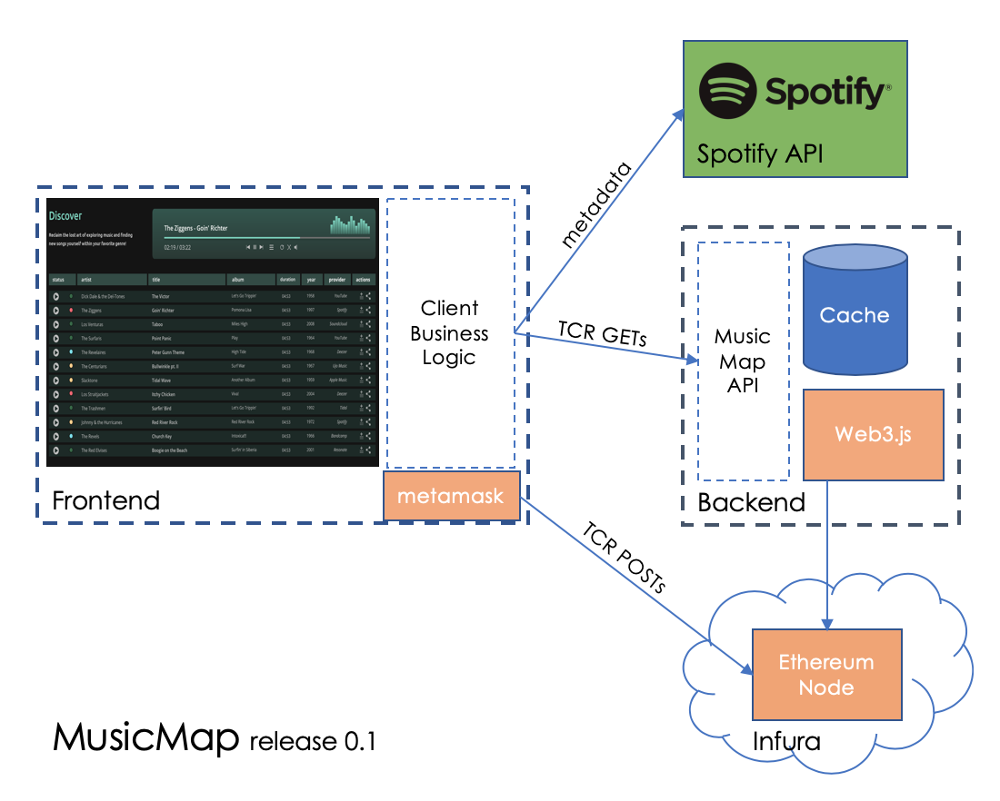

# MusicMap: Release 0.1 - Functional Specification

[UI Mockup](https://xd.adobe.com/view/18353a75-d195-464b-6048-392543616c56-6e04/)

1. Single genre will be supported as a TCR
1. Single provider will be supported - Spotify
1. Metadata will be directly loaded from the Spotify API (no separate metadata store needed)
1. Infura will be used for interacting with Ethereum network
1. A thin backend will be used to cache the registry data from the Ethereum network - MusicMap API
1. GETs will be done through the MusicMap API
1. All POST calls for TCR functionality will be done directly from the frontend using MetaMask.

## Contributor Flow

1. User pastes Spotify track Id and clicks get details
1. The app gets track/song details from Spotify API `GET https://api.spotify.com/v1/tracks/{id}`
1. Track details are shown on the screen
1. User enters the TCR parameters (account, stake, etc.)
1. User clicks submit
1. The track goes into the apply stage in the TCR

> Only the Spotify track Id is stored in the smart contract as the application.

## Consumer and Curator flow

1. User load the MusicMap genre web page
1. The frontend app loads the listings from the genre TCR smart contract (using web3.js).
1. Listings with their current state (application, accepted, challenged, rejected) are loaded in the UI
1. Based on the state, actions are shown (challenge, vote, etc.)
1. The curator can challenge or vote from here.