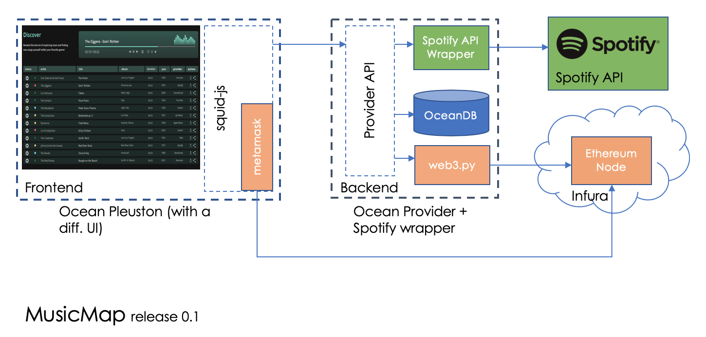

# MusicMap Application

## Release 0.1

[UI Mockup](https://xd.adobe.com/view/18353a75-d195-464b-6048-392543616c56-6e04/)

### High-level Design

1. Single genre will be supported as a TCR
1. Single provider will be supported - Spotify
1. Metadata will be directly loaded from the Spotify API (no separate metadata store needed)
1. Infura will be used for interacting with Ethereum network
1. A thin backend will be used to cache the registry data from the Ethereum network - MusicMap API
1. GETs will be done through the MusicMap API
1. All POST calls for TCR functionality will be done directly from the frontend using MetaMask.

### Contributor Flow

1. User pastes Spotify track Id and clicks get details
1. The app gets track/song details from Spotify API `GET https://api.spotify.com/v1/tracks/{id}`
1. Track details are shown on the screen
1. User enters the TCR parameters (account, stake, etc.)
1. User clicks submit
1. The track goes into the apply stage in the TCR

> Only the Spotify track Id is stored in the smart contract as the application.

### Consumer and Curator flow

1. User load the MusicMap genre web page
1. The frontend app loads the listings from the genre TCR smart contract (using web3.js).
1. Listings with their current state (application, accepted, challenged, rejected) are loaded in the UI
1. Based on the state, actions are shown (challenge, vote, etc.)
1. The curator can challenge or vote from here.

### MetaMask Integration

The frontend will be integrated with MetaMask to sign and send transactions directly to the Infura network.

### Ethereum Smart Contracts

1. The Ocean token contract will be replicated to create Proto-MMT (proto MusicMap token) contract.
1. The Ocean registry contract will be replicated to create MusicMap registry contract.

### Things to consider

1. Loading all the listings directly from the smart contract is not optimal. Server side caching should be used. The cache can be managed using cache-aside pattern for synchronization with the TCR smart contract when listing state changes.
1. In the interim, it should be OK to load all the metadata directly from the provider API. The latency to load it from a MusicMap managed metadata store would be almost the same as loading it from the provider directly. This way we can reduce a lot of data synchronization issues.

### Further Optimizations

1. Gas optimizations for calling smart contracts.
1. What should be the frequency to invalidate and update the cache?
1. Who should pay the gas costs, MusicMap or the user?

### Developer References

1. [Spotify API - Authorization](https://developer.spotify.com/documentation/general/guides/authorization-guide/)
1. [Spotify API - Get Track Info](https://developer.spotify.com/documentation/web-api/reference/tracks/get-track/)
1. [MetaMask call smart contract](https://medium.com/metamask/calling-a-smart-contract-with-a-button-d278b1e76705)